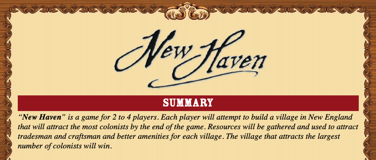

# New Haven
## In-game Images:

## Description:
The project is about writing a C++ computer game that allows the user to play a reasonable version of the New Haven game. The New Haven is a “tactical” game, the gaming rules are given [here](./docs/gamerules.pdf)

## Requirements:
### Windows:
+ Visual Studio >= 2019

### UNIX:
+ CMake version 3.15
+ Clang 
+ Clion (IDE) or simple Terminal

## Build Guide:
> **Note:**
>
> The project was built mostly on Visual Studio on Windows so it is compatible the most on Windows. 
> The proram may cause unexpected behaviour on other IDEs and platforms because of different checker, linter or compiler. 
> The proram uses CImg library for Graphical User Interface. Unfortunately, Apple has decided to stop supports for [XQuartz](https://www.xquartz.org/). OSX users might have to install additional XQuartz library to compile the project.

### Visual Studio 2019:
+ **Clone/download** the project
+ Run `NewHaven.sln`. This will automatically load the project on Visual Studio. In addition, the files were grouped together in containers if started as `solution`.
+ Click on **Local Window Debugger** to start the program

### CLion:

+ **Clone/download** the project
+ Open Clion
+ Choose **New CMake Project from Sources** at welcome page
+ Open the directory containning this project.
+ Choose **Import as a new CMake project**.
+ Tick off **CMakeLists.txt** on the list. Click **OK**.
+ The project will be loaded to Clion
+ Build -> Run 

### UNIX terminal:

+ Clone/download the Project
+ `cd` into the directory containning the project.
+ `cmake .`
+ `cmake --build .`

## Contributors:
| List |
| --------------- |
| [Duc Nguyen](https://github.com/DukeNgn)      |
| [Omar Al-Farajat](https://github.com/OmarAlFarajat) |
| [Luiz Gonçalves](https://github.com/lgonc)  |

